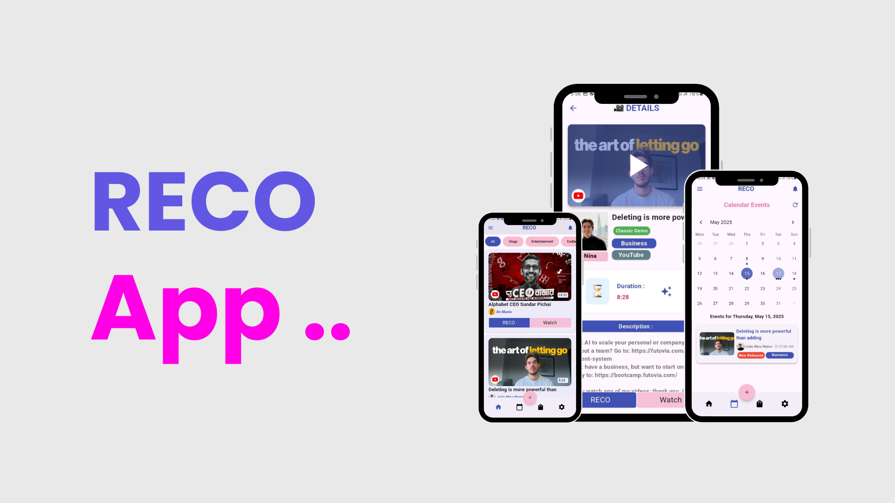
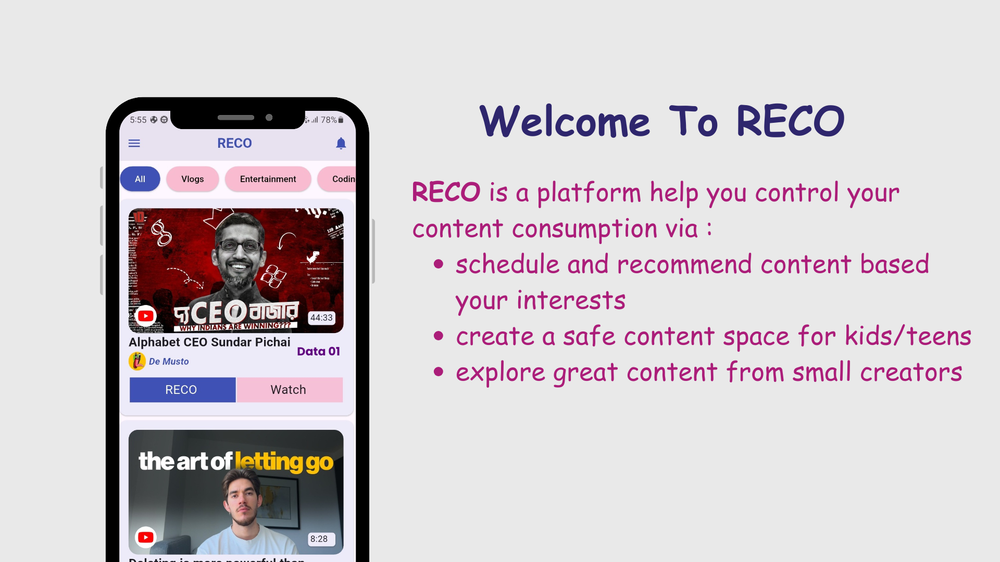
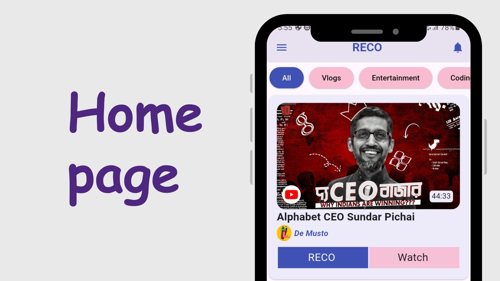
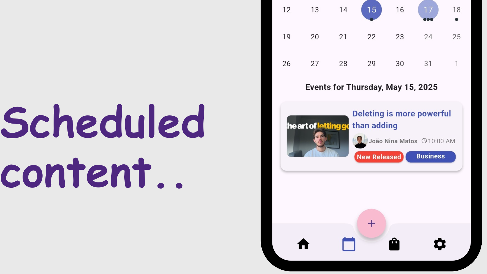
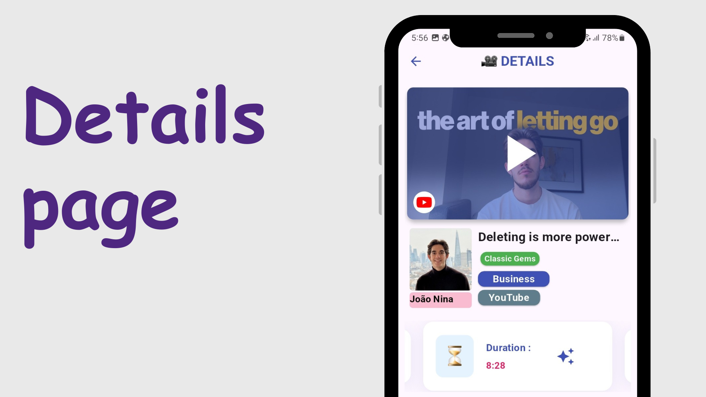
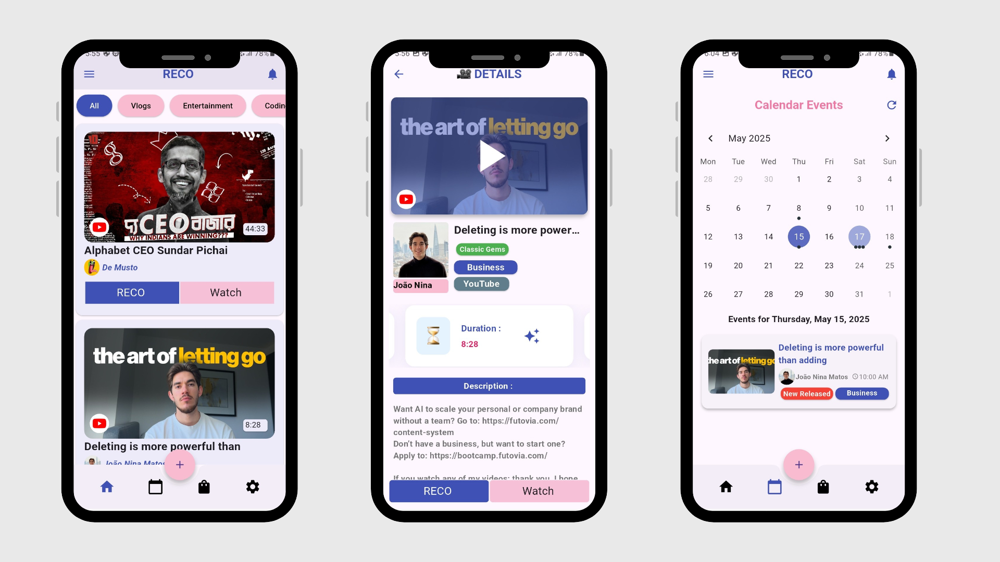

# 📱 Reco – Control your Content consumption

Reco is a Flutter app that helps users make scheduled content from ' great small creators' — like YouTube videos, Twitch streams, and podcasts —   organized by tags, genres, and interests. 

## 🚀 Features

- Scheduale contents from creators you want to follow
- Recomend new great content based on your interests
- Filter content by tags (e.g., Vlogs, Podcasts, Gaming)
- Create safe content space to children/teens based on parents recomendations
 

## 🛠 Tech Stack

- **Frontend:** Flutter (MVVM, Provider, REST API,  )
- **Backend:** Strapi (CMS hosted on Render)

## 🖼 Screenshots

